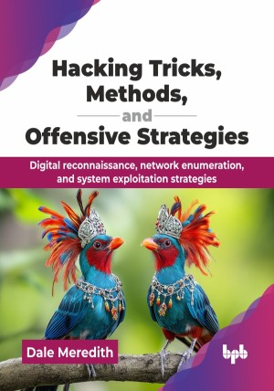

# Hacking Tricks, Methods, and Offensive Strategies

Digital reconnaissance, network enumeration, and system exploitation strategies.

This is the repository for [Hacking Tricks, Methods, and Offensive Strategies
](https://bpbonline.com/products/hacking-tricks-methods-and-offensive-strategies?variant=44707552297160),published by BPB Publications.

## About the Book
Understanding how systems are secured and how they can be breached is critical for robust cybersecurity in an interconnected digital world. The book offers a clear, practical roadmap for mastering ethical hacking techniques, enabling you to identify and fix vulnerabilities before malicious actors can exploit them.

This book guides you through the entire hacking lifecycle, starting with fundamental rules and engagement phases, then moving into extensive reconnaissance using public data, search engines, and social networks to gather intelligence. You will learn active network scanning for live systems, port identification, and vulnerability detection, along with advanced enumeration techniques like NetBIOS, SNMP, and DNS. It also proceeds to explain practical system, exploitation, covering password cracking, social engineering, and specialized tools. It also includes dedicated sections on Wi-Fi network hacks, followed by crucial post-exploitation strategies for maintaining access and meticulously covering your tracks to remain undetected.

This book helps you to properly protect data and systems by means of obvious explanations, practical recipes, and an emphasis on offensive tactics. Perfect for novices or experienced professionals with a networking background, it is your go-to tool for mastering cybersecurity and keeping hackers at bay, because slowing them down is the name of the game.

## What You Will Learn
• Use Nmap to scan networks and spot vulnerabilities in a quick manner.

• Crack passwords with tools like Hashcat and John.

• Exploit systems using Metasploit to test your defenses. 

• Secure Wi-Fi by hacking it with Aircrack-ng first.

• Think like a hacker to predict and block attacks.

• Learn maintaining system access by hiding tracks and creating backdoors.
